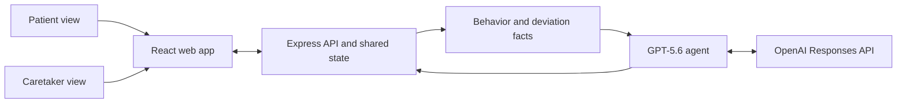
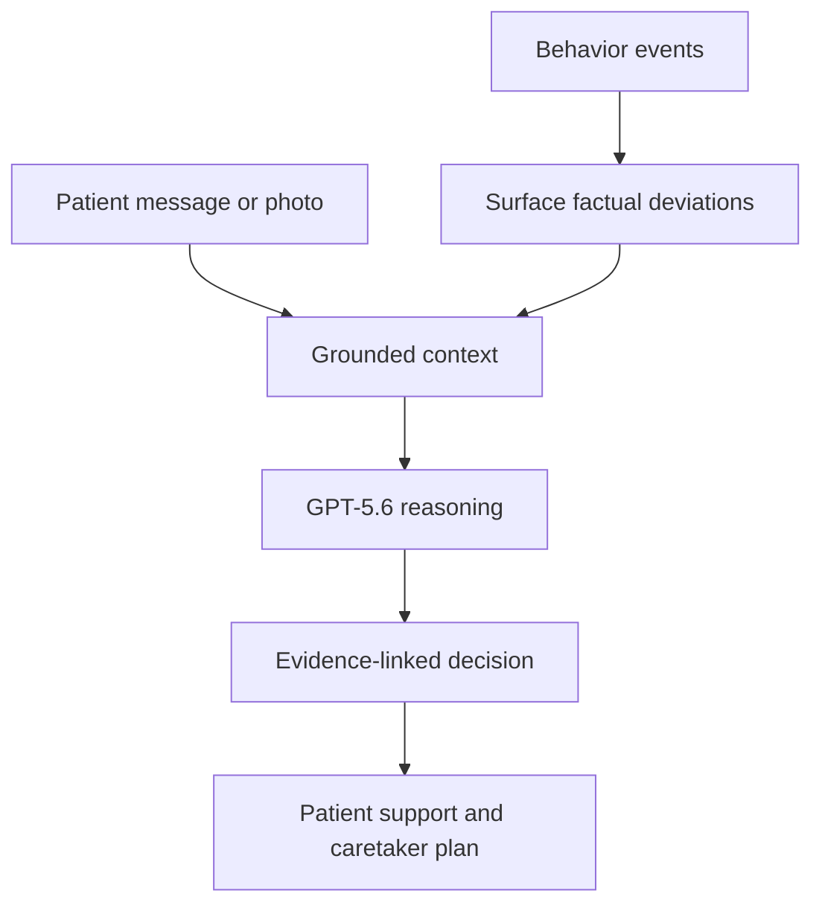

# Kikunet

> A GPT-5.6 safety companion that turns everyday signals into calm, evidence-based support for older adults and their caregivers.

<p align="center">
  
</p>

> **OpenAI Build Week — Apps for Your Life**<br>
> 🎥 Add the public YouTube demo link here before submitting.

## The problem

A missed routine, confusing journey, unusual silence, or worrying message can leave a caregiver unsure what to do next. A fixed alert or one risk score cannot explain the situation or decide whether a check-in, navigation support, or escalation is appropriate.

## The solution

Kikunet gives Meera, an older adult, a calm companion named Nia and gives her caregiver, Ananya, an evidence-linked shared view.

- **Patient support:** medication reminders, acknowledgement ticks, text and voice interaction, photo upload, and a reassuring companion.
- **Caregiver context:** evidence-linked support plan, safe-zone context, explainable drift factors, medication schedule, and daily care journal.
- **Agentic reasoning:** GPT-5.6 interprets grounded facts and chooses an intervention; it is not used as a simple classifier.

## What it does

1. Builds a deterministic daily behavior timeline for Meera.
2. Surfaces factual expected-versus-actual differences, without assigning severity or action.
3. Gives GPT-5.6 Meera’s persona, baseline, recent history, surfaced facts, direct messages, and relevant image context.
4. Returns a structured, evidence-cited support decision for the patient and caretaker experience.
5. Shares medication, location, journal, and alert state between the patient and caretaker views.

## Simple architecture





> Mermaid diagrams render on GitHub. The README uses the standard Mermaid fenced-block approach described in this [guide](https://dev.to/farisdurrani/draw-diagrams-in-readmes-using-mermaid-1c49).

## How GPT-5.6 is used

The project uses the GPT-5.6 model configured as `gpt-5.6-luna` through the OpenAI Responses API. Every model request uses environment configuration rather than a hardcoded model name:

```js
model: process.env.OPENAI_MODEL
```

### Safety reasoning agent

The safety agent receives structured context:

- Meera’s persona: mobility, cognitive-risk context, transport, language, and emergency contact.
- Baseline routine and recent behavior history.
- Factual deviations with expected, actual, and difference fields.
- Direct patient messages, optional visual observations, and prior decisions for recurrence context.

GPT-5.6 uses medium reasoning effort and returns a strict JSON-schema decision with:

- Decision and confidence
- Interpretation, plausible explanations, uncertainty assessment, and reasoning
- Surfaced-deviation IDs and cited facts for every reasoning item
- Immediate action, follow-up action, caregiver summary, and escalation flag

The server validates every response, retries malformed output once, and shows a safe fallback instead of inventing certainty.

### Companion tools and multimodal context

Nia can use GPT-selected function calls to perform real shared actions:

- Check, create, update, and acknowledge medication reminders
- Store a short-lived stated destination or medicine intent
- Escalate to the caregiver through the safety reasoning flow

Nia can receive PNG, JPEG, or WebP photos up to 6 MB alongside the patient’s stated intent and care context. For example, it can compare a photo of a Pune Junction sign with Meera’s stated plan to travel to Indore.

### Grounded daily journal

GPT-5.6 also creates a concise 3–5 sentence caregiver journal. Every generated sentence must cite real recorded activity IDs; unsupported sentences are rejected.

## How Codex was used

Codex accelerated the complete build process:

- Turned the phased product plan into the React and Express application architecture.
- Implemented the shared patient/caretaker state, safe-zone map, medication workflow, and companion history.
- Built the Responses API integration, structured decision schema, function-calling loop, visual-context flow, and daily journal.
- Helped refine the patient experience so Nia sounds calm and never repeatedly asks for location sharing.
- Added and iterated automated tests, the scenario evaluator, README, video script, and demo assets.

## Tech stack

| Area | Built with |
| --- | --- |
| Languages | JavaScript, HTML, CSS |
| Frontend | React 19, Vite 7 |
| Backend | Node.js, Express 5 |
| AI | OpenAI JavaScript SDK, OpenAI Responses API, GPT-5.6 (`gpt-5.6-luna`) |
| Agent capabilities | Function calling, strict JSON Schema, image input, medium-effort reasoning |
| Maps | Leaflet, React Leaflet, OpenStreetMap |
| Browser APIs | Geolocation, Speech Recognition, Speech Synthesis |
| Testing | Node.js built-in test runner, scenario evaluation harness |
| State | In-memory shared server state and browser-local conversation history |

> No external database is used in this MVP. Shared state resets when the server restarts.

## Run locally

### Requirements

- Node.js `^20.19.0` or `>=22.12.0`
- npm
- An OpenAI API key for live agent, companion, and journal requests

### Setup

```powershell
Copy-Item .env.example .env
npm install
npm run dev
```

Set these values in `.env`:

```dotenv
OPENAI_API_KEY=your_api_key_here
OPENAI_MODEL=gpt-5.6-luna
```

Open the two role-specific views:

- Patient: `http://127.0.0.1:5173/patient`
- Caretaker: `http://127.0.0.1:5173/caretaker`

Never commit `.env` or expose your API key in a demo recording.

## Demo flow

1. Open the patient and caretaker routes in separate tabs.
2. In the patient view, send: `I am travelling to Indore.`
3. Upload [the prepared Pune Junction image](public/demo-video-assets/pune-junction-mismatch.png) with **Use camera** and send: `Please check this station for me.`
4. If needed, send: `I feel scared and I do not know where I am.`
5. Switch to the caretaker view to show the shared decision, cited facts, safe-zone context, and drift explanation.

The complete recording narration and shot list are in [BUILD_WEEK_VIDEO_SCRIPT.md](BUILD_WEEK_VIDEO_SCRIPT.md).

## Validation

```bash
# Test the project
npm test

# Create a production frontend build
npm run build

# Run all four live reasoning scenarios; requires OPENAI_API_KEY
npm run evaluate
```

The evaluation accepts more than one safe model decision when the evidence supports it, but rejects responses that lack valid structure, citations, surfaced-deviation references, or internally consistent reasoning.

## Demo scenarios

| Scenario | Factual change |
| --- | --- |
| Missed routine | Morning medication acknowledgement is absent. |
| Prolonged stillness | A normal tea-and-reading period is much longer than Meera’s baseline. |
| Off-route station | Expected Cedar Grove Park check-in becomes a Central Railway Station check-in. |
| Communication silence | Expected afternoon and evening family check-ins are absent. |

## Safety and privacy

- Kikunet is a demo MVP using synthetic behavior data; it is not a medical device, diagnosis tool, or emergency service.
- Device location is display-only context and is not included in the Phase 3 safety reasoning prompt.
- Browser location needs permission and a secure context. Use it only with informed consent.
- The app exposes concise evidence-linked rationale, not private chain-of-thought.
- The repository includes [video assets](public/demo-video-assets/) and a [submission video script](BUILD_WEEK_VIDEO_SCRIPT.md); review recordings for keys, personal addresses, and live coordinates before publishing.

---

Built for OpenAI Build Week, **Apps for Your Life**.
